# iPhone to Analog Film — The Hard Way

I wanted my iPhone photos to look like they were shot on real 35mm film. Not the VSCO/Instagram "film look" — I mean actually indistinguishable from analog. The kind of thing where someone asks "what camera is that?"

Turns out, everyone who's tried this has been doing it wrong. Including me, for the first four attempts.

## The results

### Toronto at golden hour

**Original (iPhone)**

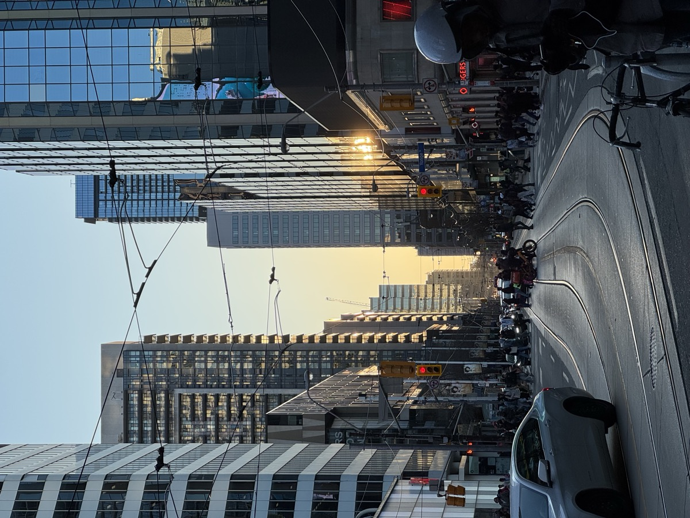

**Cinestill 800T** — tungsten-balanced, aggressive halation around the lights (no remjet layer = light bounces off film base)

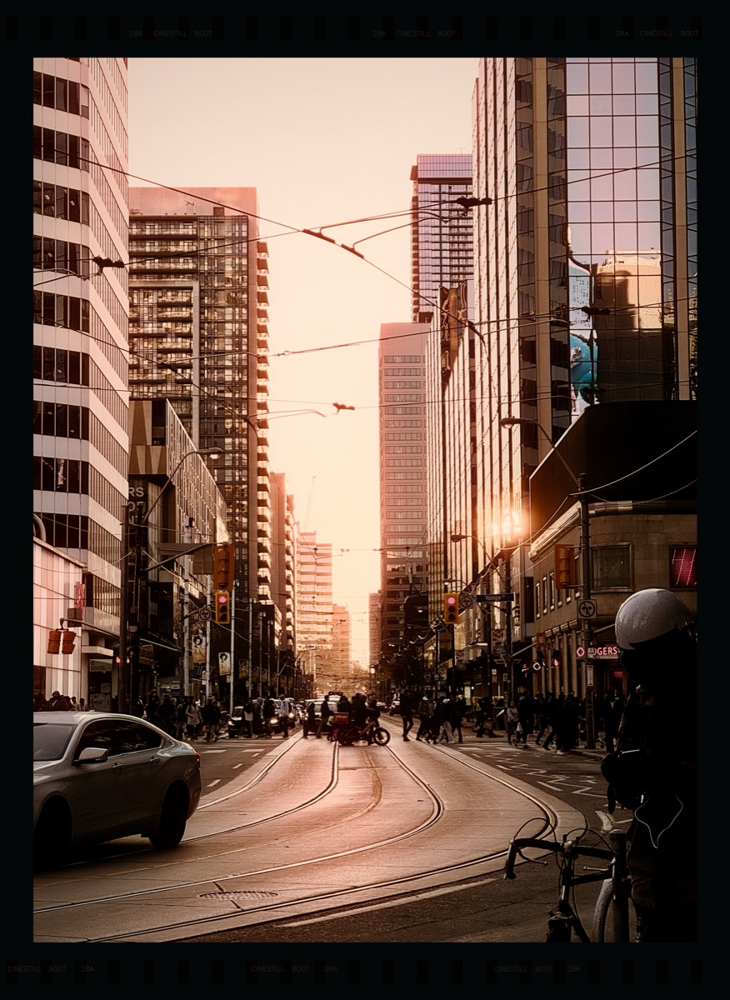

**Kodak Portra 400** — the classic. Warm skin tones, lifted shadows, pastel highlights.

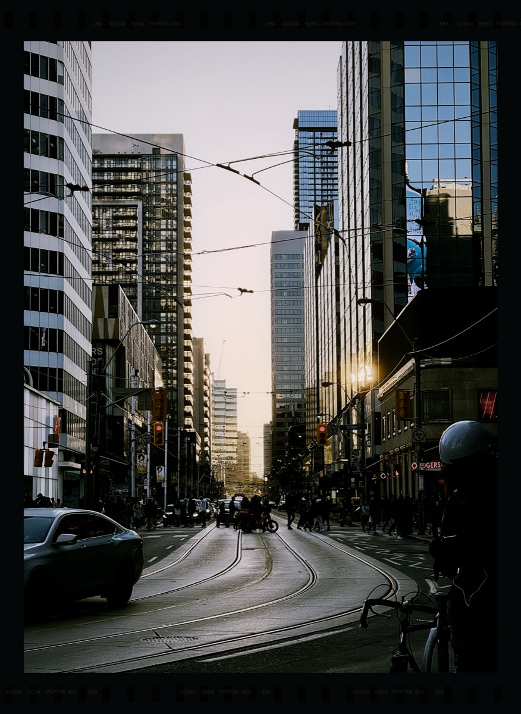

---

### Mirror selfie

**Original**

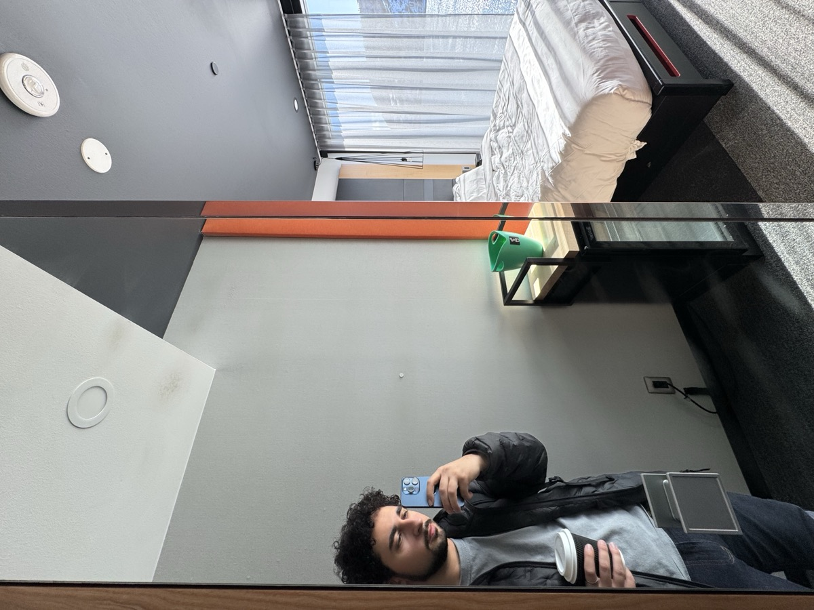

**Portra 400**

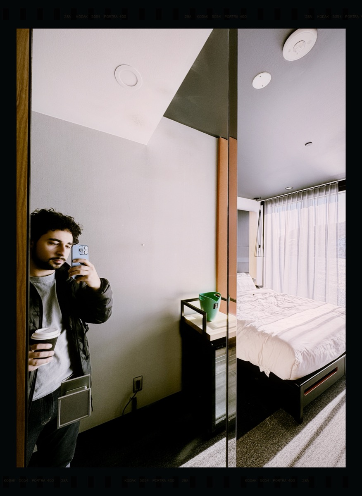

**Fuji Pro 400H** — cooler than Portra, slightly green shadows, airy highlights

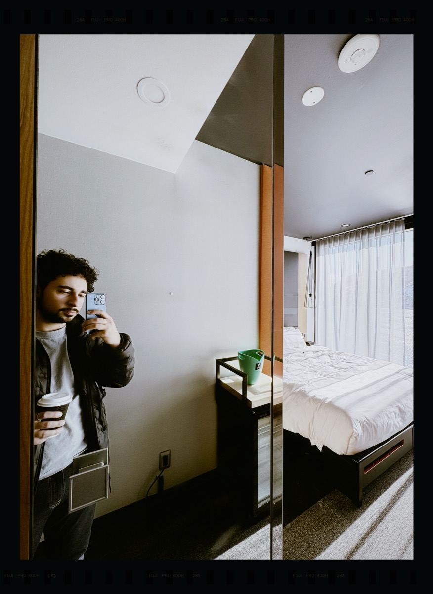

---

### The Rock

**Original**

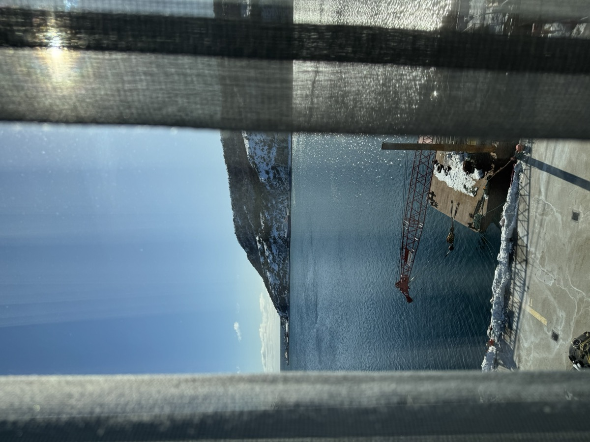

**Kodak Gold 200** — punchy, saturated, warm. The consumer film look.

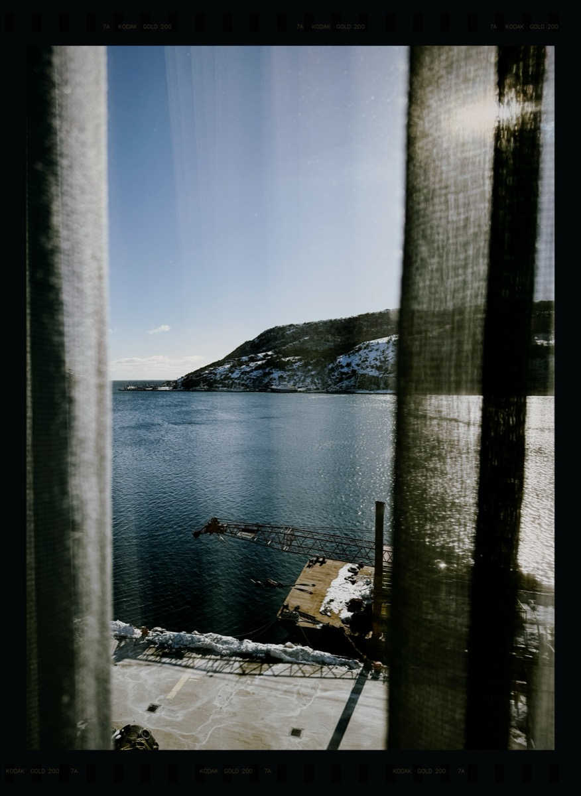

**Portra 400**

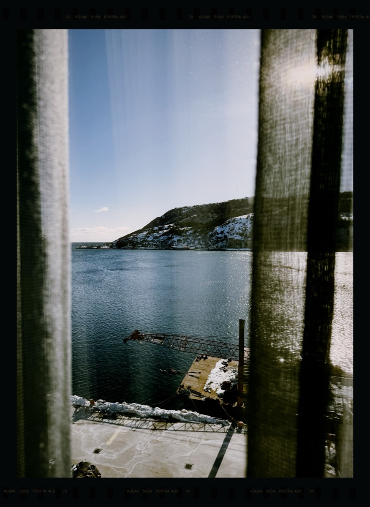

---

### Air Canada at dawn

**Original** | **Portra 400**
:---:|:---:
 | 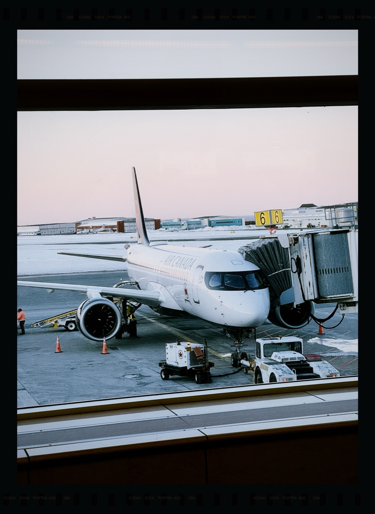

### Color cube at night

**Original** | **Cinestill 800T**
:---:|:---:
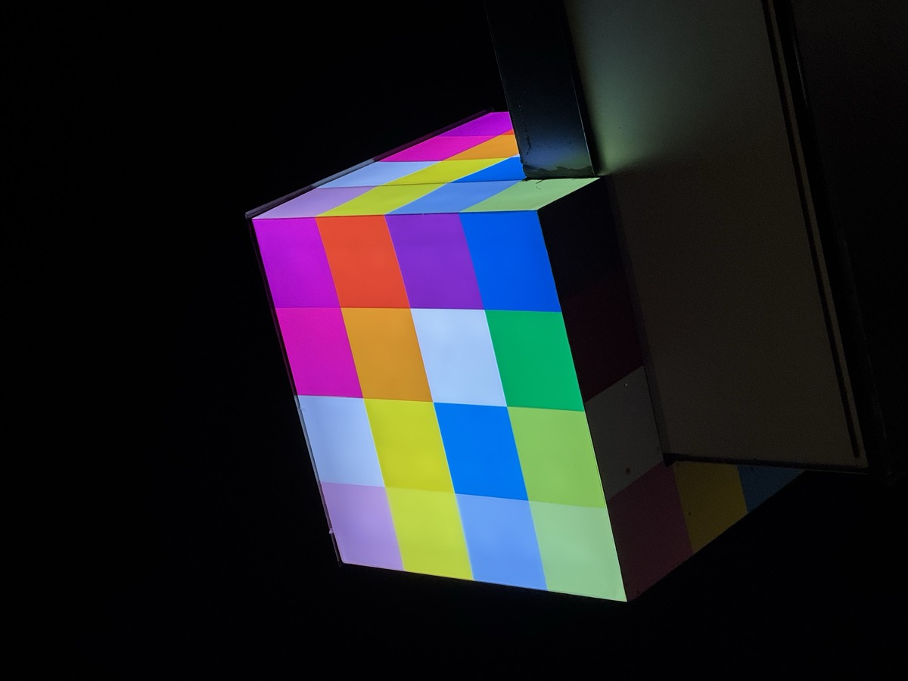 | 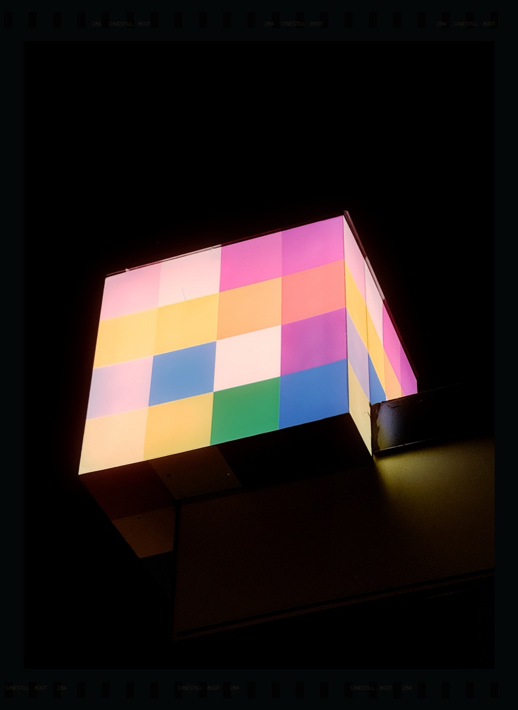

---

## Why everything else fails

Here's the thing nobody tells you: **you cannot color grade a digital photo to look like film.** Every Instagram preset, every Lightroom pack, every "cinematic LUT" on the internet — they're all adjusting curves and saturation in output color space. That's fundamentally the wrong approach.

Real film is a **two-stage photochemical process**:

1. **Negative film** — light hits silver halide crystals across 3 emulsion layers. Each layer (cyan, magenta, yellow) has its own characteristic curve mapping exposure to density. The gamma is ~0.6.

2. **Print film** — the negative gets optically projected onto print stock (like Kodak 2383). This print stock has its *own* much steeper characteristic curve (gamma ~3.0). The interaction between these two curves is where the entire film look comes from.

The color crossover in shadows, the highlight rolloff, the way Portra handles skin vs. how Gold handles greens — all of that emerges from light passing through these two photochemical stages. You can't approximate a nonlinear two-stage optical process by dragging RGB sliders around. I tried. Four times.

## The 8-version journey

I'm not going to pretend I got this right on the first try.

**v1–v2**: Hand-tuned per-channel curves, custom halation, grain overlay. Looked exactly like what it was — an iPhone photo with a filter on top. The kind of thing that gets 3 likes from your mom.

**v3**: Tried to fix the digital look by upscaling 4x, dissolving the pixel grid with median filters, adding multi-scale grain. Better texture, but the colors were still wrong. You can dress up a digital photo all you want — if the color science is fake, it looks fake.

**v4**: Went all in on effects — DOF simulation, light leaks, dust, scratches, film borders with sprocket holes. More convincing at thumbnail size. Still obviously digital when you actually look at it. This is the trap most people fall into: adding analog *artifacts* without fixing the fundamental *color*.

**v5 (the breakthrough)**: Found [spectral_film_lut](https://github.com/JanLohse/spectral_film_lut), an open-source library that models the actual negative→print photochemical pipeline using real manufacturer datasheets. Kodak publishes densitometry data for every stock — spectral response curves, characteristic curves, the works. This library digitizes all of that and simulates light passing through the negative and then through print stock. The color difference was immediate and massive.

**v6**: Added everything the $1000 professional plugins do — volumetric grain from actual RMS granularity data (each film stock has measured grain characteristics in its datasheet), film breath (subtle exposure variation from uneven emulsion coating), gate weave (micro-position shifts from film not sitting perfectly in the camera gate), film acutance simulation (film's MTF is different from digital — soft at high frequencies but strong mid-frequency contrast, which is why film looks "sharp" despite being technically lower resolution).

**v7**: Realized we'd been processing 768×1024 thumbnails from the Photos Library `derivatives` folder this entire time instead of the actual 4032×3024 / 5712×4284 originals. Also replaced bicubic upscaling with Real-ESRGAN AI upscaling. Facepalm moment.

**v8 (current)**: Full-resolution originals, no upscaling needed, optimized pipeline. Profiled every step and found that `film_breath` was taking 168 seconds per image because of a massive Gaussian blur on a 24-megapixel image — for what amounts to a barely-visible low-frequency variation. Generated the effect at 16×16 resolution and upscaled instead. Total processing: ~30 seconds per image down from ~4 minutes.

## How it actually works

The pipeline, in order:

```
iPhone HEIC (full res) → JPEG conversion
  → Film acutance (MTF simulation — soft high freq, boost mid freq)
  → Gate weave (random sub-pixel shift + micro rotation)
  → Negative → Print conversion (spectral_film_lut — the core)
  → Film breath (low-frequency exposure variation)
  → Halation (bright highlights bleed warm light into surroundings)
  → Bloom (soft glow on highlights)
  → Vignette (natural lens falloff)
  → Volumetric grain (RMS granularity data from film datasheets, per-channel)
  → Dust & artifacts
  → Film border (sprocket holes, frame numbers, stock text)
```

### The important bit: spectral_film_lut

This is the only open-source tool I've found that does the neg→print pipeline correctly. It takes Kodak/Fuji's published datasheet curves and simulates:

- Spectral response of the negative emulsion layers
- Density-to-transmission conversion
- Optical projection onto print stock
- Print stock's own characteristic curves
- Gamut compression for out-of-range colors

The conversion function takes an sRGB image and outputs sRGB — but internally it's doing spectral math that models what actually happens when light passes through silver halide crystals.

### Grain that isn't noise

Film grain is not Gaussian noise overlaid on an image. Real grain is clusters of metallic silver crystals in three independent emulsion layers. Each stock has measured RMS granularity values (measured with a 48μm aperture at density 1.0). Grain intensity varies with exposure — more visible in midtones, less in highlights and deep shadows. Grain has spatial structure (clumping) that depends on the crystal type.

The `grain_transform` from spectral_film_lut maps each pixel's density to the correct grain intensity based on the manufacturer's actual RMS measurements. I generate noise at the correct physical scale (based on 35mm frame dimensions), add multi-scale clustering, then modulate per-pixel using the datasheet curves.

### Halation

When light hits film, some of it passes through the emulsion, bounces off the film base, and re-exposes from behind. This creates a warm glow around bright areas. Cinestill 800T (which is repackaged Kodak Vision3 500T with the remjet anti-halation layer removed) has extreme halation — that's the red/orange glow you see around lights in those viral night photos.

## Film stocks

| Stock | Character | Good for |
|-------|-----------|----------|
| **Kodak Portra 400** | Warm skin tones, pastel highlights, lifted shadows, low contrast | Portraits, golden hour, anything with people |
| **Fuji Pro 400H** | Cooler, green-shifted shadows, airy highlights | Overcast days, editorial, clean/minimal |
| **Kodak Gold 200** | Punchy, saturated, warm yellows/reds | Travel, daytime, the "nostalgic" look |
| **Cinestill 800T** | Tungsten-balanced, blue shadows, extreme halation | Night, city lights, neon, moody |

Cinestill is modeled as Kodak Vision3 500T (`sfl.KODAK_5219`) with tungsten white balance (3200K) and cranked halation.

## Has anyone done this before?

At the professional level, yes:

- **Filmbox** ($995) by Video Village — the gold standard. Uses dense spectral datasets, models the complete Kodak Vision3 ecosystem with a two-module (negative + print) approach. Used on actual Hollywood productions. Only works in DaVinci Resolve.

- **Dehancer** ($449) — profiles built from colorimetry and densitometry of real darkroom prints (not scans). 3D volumetric grain simulation. Custom mathematical model for color morphing that goes beyond standard LUT interpolation.

- **Color.io** — newer, also does volumetric grain with film resolution control in nanometers.

As an open-source, code-only, runs-from-the-command-line thing? Not really. Most open-source attempts are still in the "adjust RGB curves and call it film" camp. The spectral_film_lut library is the breakthrough — it gives you the same physical modeling approach that the expensive plugins use, but as a Python function call.

## Running it

### Dependencies

```bash
pip install opencv-python numpy scipy
pip install git+https://github.com/JanLohse/spectral_film_lut.git
pip install colour-science numba
```

### Usage

Edit the `images` dict in `film_process.py` with your own photo paths and stock choices, then:

```bash
python film_process.py
```

Outputs bordered + clean JPGs at full resolution. Processing is ~30 seconds per image on Apple Silicon.

### Adding your own photos

```python
images = {
    "my_photo": {
        "path": Path("/path/to/your/photo.jpeg"),
        "stocks": ["portra400", "cinestill800t"],  # pick any combo
    },
}
```

If your photos are HEIC (iPhone default), convert first:
```bash
sips -s format jpeg -s formatOptions 100 input.heic --out output.jpeg
```

## What still can't be faked

Even with physically accurate color science, some things are fundamentally baked into the digital capture:

- **Depth of field** — iPhone's tiny sensor = everything in focus. We don't simulate DOF because it always looks fake.
- **Lens character** — real film lenses have specific bokeh, flare patterns, and optical aberrations
- **Dynamic range behavior** — iPhone stacks multiple exposures computationally. Film captures one moment with its own latitude.
- **Motion blur** — mechanical shutter has a different quality than electronic rolling shutter

But honestly, the color science is 90% of what makes film look like film. Get that right and the rest is details.

## Credits

- [spectral_film_lut](https://github.com/JanLohse/spectral_film_lut) by Jan Lohse — the backbone of the color conversion. Incredible work.
- All the film science knowledge comes from studying how [Dehancer](https://www.dehancer.com/), [Filmbox](https://videovillage.com/filmbox/), and [Color.io](https://www.color.io/) approach the problem, then finding open-source equivalents.
