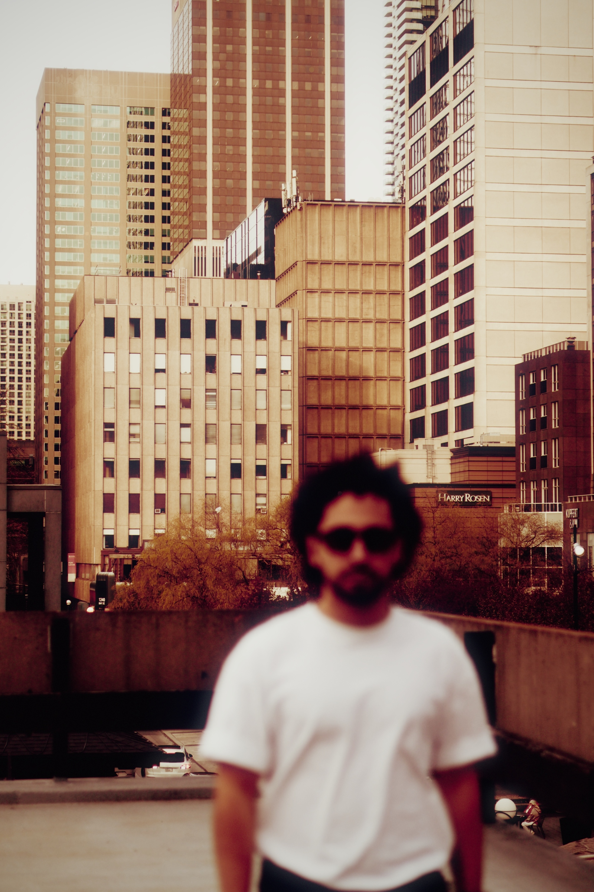
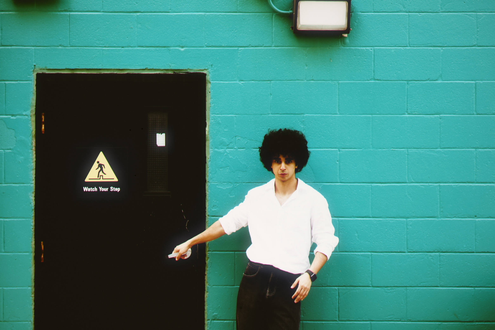
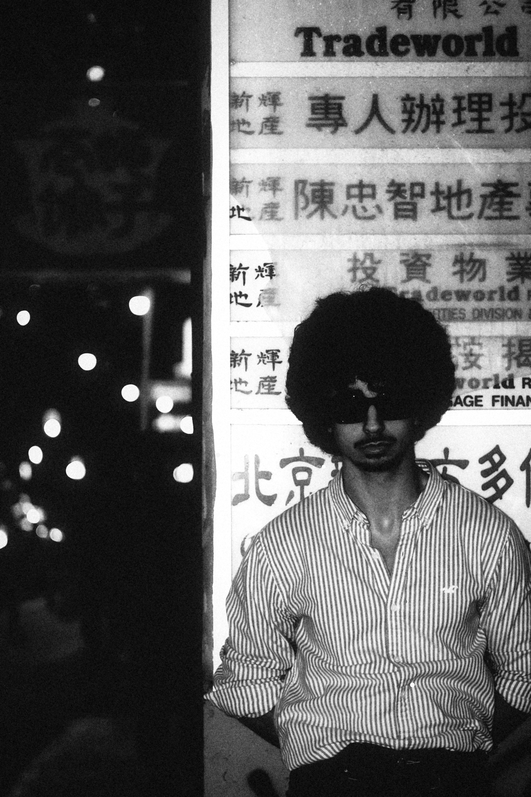

# iPhone to Analog Film — The Hard Way

> *Photochemical reactions vs photons and circuitry. This is a hot debate... but many believe (myself included) that we can emulate all the qualities of film with digital capture. It's just a matter of knowing how, and putting in the work.*
> — [@imPatrickT](https://x.com/imPatrickT)

I wanted my iPhone photos to look like they were shot on real 35mm film. Not the VSCO/Instagram "film look" — I mean actually indistinguishable from analog. The kind of thing where someone asks "what camera is that?"

Turns out, everyone who's tried this has been doing it wrong. Including me, for the first four attempts.

## The new results (v9)

The pipeline below was rewritten end-to-end. Halation and bloom now run in linear light. Halation masks from the red channel (red/IR penetrates film deepest — that's *why* halation reads as red). Grain was rebuilt with separate luma and chroma textures with a chroma-gate that kills the magenta/green speckle in deep shadows. Tone response is midtone-peaked, with grain falling off in both blacks and whites the way actual silver-halide does.

Stocks now expose a per-stock "Look" — halation, bloom, vignette, scanner warmth, light leak, chromatic aberration, scratches, grain amount, and a few more — surfaced as sliders in the web/desktop app and stored as authored defaults per stock. There are also new pushed B&W stocks and 1970s cinema looks. Everything is wired through a CLI, a web app, and a native macOS `.app`.

### Bay Street, Toronto — Kodak 5247 (1970s cinema neg)

Vision3's grandparent. Warm midtones, soft contrast, a halation halo on the bright sky.



### Teal wall — Fuji Pro 400H

Cool greens, lifted shadows, the classic editorial Fuji palette.



### Snowboarding — Tri-X 400 pushed

Pushed Tri-X eats highlights and lifts the deep blacks; the sky goes graphite, faces punch.


### Hong Kong at night — Tri-X 400 hard push

Hard push for low-light. Gritty grain in the midtones, shadows go properly dense, not muddy.



---

## Earlier results (v6–v8)

### Toronto at golden hour

**Original (iPhone)**


**Cinestill 800T** — tungsten-balanced, aggressive halation around the lights (no remjet layer = light bounces off film base)


**Kodak Portra 400** — the classic. Warm skin tones, lifted shadows, pastel highlights.


---

### Mirror selfie

**Original**


**Portra 400**


**Fuji Pro 400H** — cooler than Portra, slightly green shadows, airy highlights


---

### The Rock

**Original**


**Kodak Gold 200** — punchy, saturated, warm. The consumer film look.


**Portra 400**


---

### Air Canada at dawn

**Original** | **Portra 400**
:---:|:---:
 | 

### Color cube at night

**Original** | **Cinestill 800T**
:---:|:---:
 | 

---

## Why everything else fails

Here's the thing nobody tells you: **you cannot color grade a digital photo to look like film.** Every Instagram preset, every Lightroom pack, every "cinematic LUT" on the internet — they're all adjusting curves and saturation in output color space. That's fundamentally the wrong approach.

Real film is a **two-stage photochemical process**:

1. **Negative film** — light hits silver halide crystals across 3 emulsion layers. Each layer (cyan, magenta, yellow) has its own characteristic curve mapping exposure to density. The gamma is ~0.6.

2. **Print film** — the negative gets optically projected onto print stock (like Kodak 2383). This print stock has its *own* much steeper characteristic curve (gamma ~3.0). The interaction between these two curves is where the entire film look comes from.

The color crossover in shadows, the highlight rolloff, the way Portra handles skin vs. how Gold handles greens — all of that emerges from light passing through these two photochemical stages. You can't approximate a nonlinear two-stage optical process by dragging RGB sliders around. I tried. Four times.

## The 9-version journey

I'm not going to pretend I got this right on the first try.

**v1–v2**: Hand-tuned per-channel curves, custom halation, grain overlay. Looked exactly like what it was — an iPhone photo with a filter on top. The kind of thing that gets 3 likes from your mom.

**v3**: Tried to fix the digital look by upscaling 4x, dissolving the pixel grid with median filters, adding multi-scale grain. Better texture, but the colors were still wrong. You can dress up a digital photo all you want — if the color science is fake, it looks fake.

**v4**: Went all in on effects — DOF simulation, light leaks, dust, scratches, film borders with sprocket holes. More convincing at thumbnail size. Still obviously digital when you actually look at it. This is the trap most people fall into: adding analog *artifacts* without fixing the fundamental *color*.

**v5 (the breakthrough)**: Found [spectral_film_lut](https://github.com/JanLohse/spectral_film_lut), an open-source library that models the actual negative→print photochemical pipeline using real manufacturer datasheets. Kodak publishes densitometry data for every stock — spectral response curves, characteristic curves, the works. This library digitizes all of that and simulates light passing through the negative and then through print stock. The color difference was immediate and massive.

**v6**: Added everything the $1000 professional plugins do — volumetric grain from actual RMS granularity data (each film stock has measured grain characteristics in its datasheet), film breath (subtle exposure variation from uneven emulsion coating), gate weave (micro-position shifts from film not sitting perfectly in the camera gate), film acutance simulation (film's MTF is different from digital — soft at high frequencies but strong mid-frequency contrast, which is why film looks "sharp" despite being technically lower resolution).

**v7**: Realized we'd been processing 768×1024 thumbnails from the Photos Library `derivatives` folder this entire time instead of the actual 4032×3024 / 5712×4284 originals. Also replaced bicubic upscaling with Real-ESRGAN AI upscaling. Facepalm moment.

**v8**: Full-resolution originals, no upscaling needed. Profiled every step and found that `film_breath` was taking 168 seconds per image because of a massive Gaussian blur on a 24-megapixel image — for what amounts to a barely-visible low-frequency variation. Generated the effect at 16×16 resolution and upscaled instead. Total processing: ~30 seconds per image down from ~4 minutes.

**v9 (current)**: Top-to-bottom audit of every effect. Most of v6–v8's "magic numbers" turned out to be wrong in physically-meaningful ways:

- **Halation and bloom were running in sRGB-encoded space.** Both are *optical scattering* — light bouncing inside the film and lens. Photons don't care about gamma. Moved them to a linear-light stage between the spectral conversion and the final sRGB encode. Bloat in midtones is gone; highlights actually halate the way they should.
- **Halation was masked from grayscale luma.** Real halation is dominantly red/IR — red photons penetrate the silver-halide layers deepest, hit the film base, and reflect back. A bright blue sky was getting Cinestill-style red glow. Now masked from the red channel; the diagnostic "Cinestill bleed" only fires where it should.
- **Grain in the shadows was speckled magenta/green** because the chroma component was firing into pure black. Split the texture into a luma channel and a chroma channel; chroma is gated by luminance and silenced below ~6% gray. Tone response peaks at midtones (where film actually has the most grain) and goes to *zero* at pure black and pure white instead of holding a 20% floor.
- **Gate weave was dropped from stills.** It's a per-frame projector wobble — invisible on a still, but it costs you ~½ pixel of sharpness. Replaced with sub-pixel channel misregistration, which is the cue that actually reads as "film" on a still image.
- **Halation/bloom radii now scale by `film_format_mm`** instead of being a fixed fraction of the digital frame. Halation on 6×7 is physically smaller relative to frame than on 35mm.
- **Per-stock "Look" controls.** Acutance, scanner warmth, light leak, chromatic aberration, scratches/hairs, grain amount, highlight rolloff knee/strength, etc. All overridable per stock and exposed as live sliders in the web/desktop app.
- **An ASC-CDL grade slot** (slope/offset/power per channel + saturation) sits after halation so each stock can express character without baking new spectral LUTs.
- **Adaptive exposure**: optional auto-print mode that targets a midtone density via histogram percentile, the way a real lab would.
- **Native RAW in the CLI** via `rawpy` (the web app already had it). `.cr3 / .nef / .arw / .dng / .raf / .rw2 / .orf / .pef / .srw / .x3f` go straight in.
- **Web UI**: per-stock "Look" sidebar that auto-baselines to the selected stock's authored values; switch to Cinestill 800T and the halation slider jumps to 0.6 because that's what the stock authors. "Apply to batch" button on every gallery tile applies the exact recipe (stock + print + slider state) to N uploaded photos and zips the results.
- **Native macOS app**: PyInstaller bundle wrapping the FastAPI server in a Cocoa webview window. `dist/Film.app`, double-click, no browser needed.

## How it actually works

The pipeline, in order (sRGB-encoded unless noted):

```
load (JPEG / PNG / HEIC / 16-bit TIFF / RAW via rawpy)
  → Film acutance        (perceptual softening, kills digital crispness)
  → Channel misregistration  (sub-pixel R/G/B layer offset — film cue on stills)
  → Chromatic aberration (optional per-stock; cheap radial scale)
  → Auto-exposure        (optional per-stock; lab-style print density)
  → Negative → Print     (spectral_film_lut — the core)
  ┌─ LINEAR LIGHT ───────────────────────────────────────────────┐
  │  → Halation          (red-channel mask, two-scale point-spread)│
  │  → Bloom             (linear screen blend on highlights)        │
  └──────────────────────────────────────────────────────────────┘
  → ASC-CDL grade        (optional per-stock; slope/offset/power/sat)
  → Highlight rolloff    (tanh shoulder)
  → Film breath          (low-freq exposure wobble)
  → Vignette             (natural lens falloff, scaled per format)
  → Scanner warmth       (subtle R lift + black-point bleed)
  → Light leak           (optional per-stock)
  → Volumetric grain     (luma + chroma-gated; midtone-peak; per-stock RMS)
  → Film base tint       (optional; reversal/instant warm-white base)
  → Dust + scratches + hairs
  → uint8 / 16-bit TIFF
  → Film border          (35mm gets sprocket holes; medium-format clean)
```

`_to_linear` / `_to_srgb` use the piecewise IEC sRGB EOTF/OETF, not pure 2.2 — stays correct in the dark range where the power approximation has the wrong slope.

### The important bit: spectral_film_lut

This is the only open-source tool I've found that does the neg→print pipeline correctly. It takes Kodak/Fuji's published datasheet curves and simulates:

- Spectral response of the negative emulsion layers
- Density-to-transmission conversion
- Optical projection onto print stock
- Print stock's own characteristic curves
- Gamut compression for out-of-range colors

The conversion function takes an sRGB image and outputs sRGB — but internally it's doing spectral math that models what actually happens when light passes through silver halide crystals.

### Grain that isn't noise

Film grain is not Gaussian noise overlaid on an image. Real grain is clusters of metallic silver crystals in three independent emulsion layers. Each stock has measured RMS granularity values (measured with a 48μm aperture at density 1.0). Grain intensity varies with exposure — more visible in midtones, less in highlights and deep shadows. Grain has spatial structure (clumping) that depends on the crystal type.

The `grain_transform` from spectral_film_lut maps each pixel's density to the correct grain intensity based on the manufacturer's actual RMS measurements. I generate noise at the correct physical scale (based on 35mm frame dimensions), add multi-scale clustering, then modulate per-pixel using the datasheet curves.

### Halation

When light hits film, some of it passes through the emulsion, bounces off the film base, and re-exposes from behind. This creates a warm glow around bright areas. Cinestill 800T (which is repackaged Kodak Vision3 500T with the remjet anti-halation layer removed) has extreme halation — that's the red/orange glow you see around lights in those viral night photos.

## Film stocks

50 stocks across 7 categories — pro color neg, consumer, modern cinema, vintage cinema, B&W, slide/reversal, instant + cross-process. A few highlights:

| Stock | Character | Good for |
|-------|-----------|----------|
| **Kodak Portra 400** | Warm skin tones, pastel highlights, lifted shadows, low contrast | Portraits, golden hour, anything with people |
| **Fuji Pro 400H** | Cooler, green-shifted shadows, airy highlights | Overcast days, editorial, clean/minimal |
| **Kodak Gold 200** | Punchy, saturated, warm yellows/reds | Travel, daytime, the "nostalgic" look |
| **Cinestill 800T** | Tungsten-balanced, blue shadows, extreme halation | Night, city lights, neon, moody |
| **Kodak Vision3 500T / 50D / 250D** | Modern cinema neg | The look behind most films shot since ~2009 |
| **Kodak 5247 / 5248 / 5277 / 5293** | 1970s–80s cinema | Vintage cinema palette, softer contrast |
| **Tri-X 400 / Tri-X pushed / hard-pushed** | Classic B&W | Documentary, low-light, gritty street |
| **Kodachrome 64 / Velvia 50 / Ektachrome** | Slide film | High contrast, deep saturation |
| **Aerochrome / x-pro variants** | Cross-process & infrared | Surreal greens-to-magenta, vintage-fashion looks |

Each stock pairs a negative emulsion (e.g. `KODAK_PORTRA_400`) with a print (`KODAK_2383`, `FUJI_CA_DPII`, etc.). The web app's Gallery view shows every stock × print combination as a contact sheet.

Cinestill is modeled as Kodak Vision3 500T (`sfl.KODAK_5219`) with tungsten white balance (3200K) and cranked halation.

## Has anyone done this before?

At the professional level, yes:

- **Filmbox** ($995) by Video Village — the gold standard. Uses dense spectral datasets, models the complete Kodak Vision3 ecosystem with a two-module (negative + print) approach. Used on actual Hollywood productions. Only works in DaVinci Resolve.

- **Dehancer** ($449) — profiles built from colorimetry and densitometry of real darkroom prints (not scans). 3D volumetric grain simulation. Custom mathematical model for color morphing that goes beyond standard LUT interpolation.

- **Color.io** — newer, also does volumetric grain with film resolution control in nanometers.

As an open-source, code-only, runs-from-the-command-line thing? Not really. Most open-source attempts are still in the "adjust RGB curves and call it film" camp. The spectral_film_lut library is the breakthrough — it gives you the same physical modeling approach that the expensive plugins use, but as a Python function call.

## Running it

### Dependencies

```bash
pip install -r requirements.txt
```

That covers `fastapi`, `uvicorn`, `opencv-python`, `numpy`, `scipy`, `Pillow`, `pillow-heif`, `rawpy`, `colour-science`, and `spectral_film_lut`. RAW input is handled natively — no need to pre-convert HEIC or RAW.

### CLI

```bash
python3 film_process.py samples/aircanada_original.jpg --stocks portra400 cinestill800t trix400
```

Outputs bordered + clean JPEGs and a 16-bit TIFF per stock at full resolution. ~30 seconds per image on Apple Silicon. Run `python3 film_process.py --help` for the full stock list.

### Web app

```bash
python3 -m web.app   # http://localhost:8000
```

Drag in JPEG / PNG / HEIC / TIFF / RAW (`.cr3`, `.nef`, `.arw`, `.dng`, `.raf`, etc.). Pick a stock; tune the photochemical sliders (exposure, sat, shadow lift, white point, tint) and the per-stock "Look" sliders (halation, bloom, vignette, grain, scanner, light leak, CA, scratches, …). Export full-res JPEG + 16-bit TIFF. The Gallery view contact-sheets every stock × print combination — and each tile has an "Apply to batch" button that processes N uploaded photos with that exact recipe.

### Desktop app (macOS)

A native `.app` bundle ships the web UI inside a Cocoa webview — same interface, no browser, no terminal.

```bash
pip install --break-system-packages pywebview pyinstaller
pyinstaller film.spec --noconfirm
open dist/Film.app
```

`Film.app` is ~460 MB (numpy + opencv + scipy + rawpy + spectral_film_lut all bundled). User data lands in `~/Library/Application Support/Film/`. Build details and the rest of the architecture notes live in [CLAUDE.md](CLAUDE.md).

## What still can't be faked

Even with physically accurate color science, some things are fundamentally baked into the digital capture:

- **Depth of field** — iPhone's tiny sensor = everything in focus. We don't simulate DOF because it always looks fake.
- **Lens character** — real film lenses have specific bokeh, flare patterns, and optical aberrations
- **Dynamic range behavior** — iPhone stacks multiple exposures computationally. Film captures one moment with its own latitude.
- **Motion blur** — mechanical shutter has a different quality than electronic rolling shutter

But honestly, the color science is 90% of what makes film look like film. Get that right and the rest is details.

## Credits

- [spectral_film_lut](https://github.com/JanLohse/spectral_film_lut) by Jan Lohse — the backbone of the color conversion. Incredible work.
- All the film science knowledge comes from studying how [Dehancer](https://www.dehancer.com/), [Filmbox](https://videovillage.com/filmbox/), and [Color.io](https://www.color.io/) approach the problem, then finding open-source equivalents.
